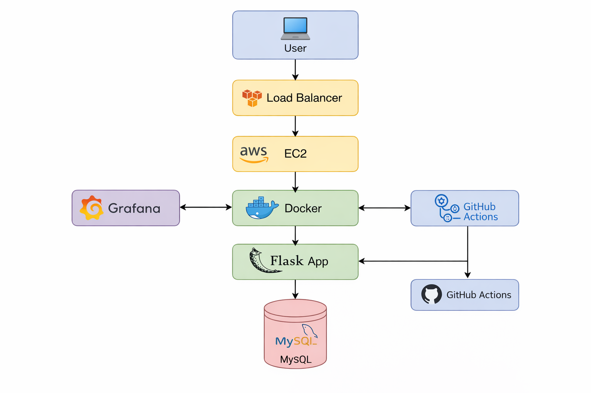
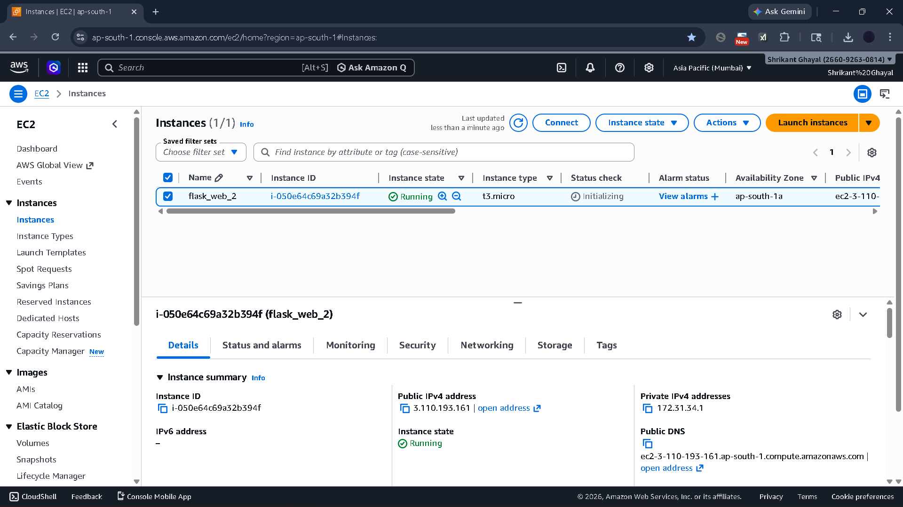
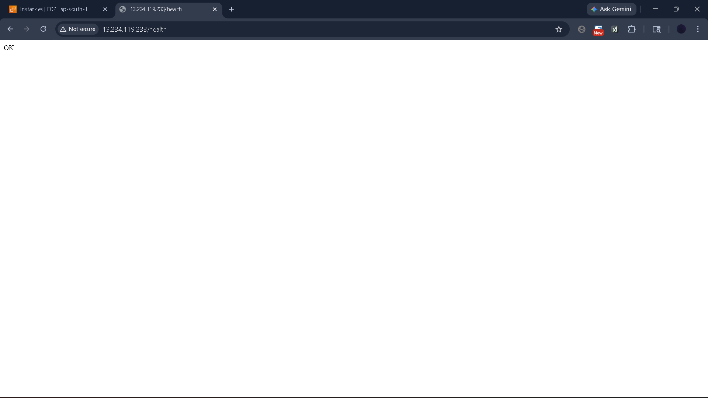
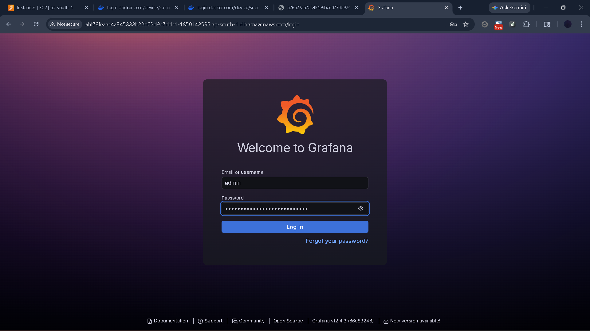
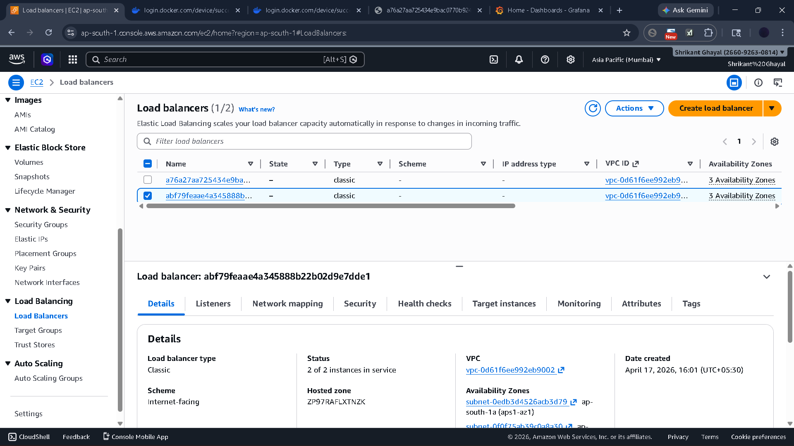
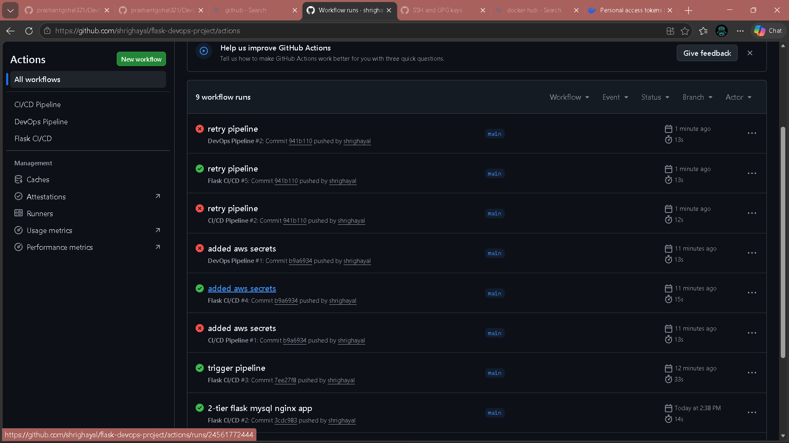

# 🚀 Flask DevOps Project (CI/CD + Docker + AWS + Grafana)


## 📌 Project Overview

This project demonstrates a complete **DevOps pipeline** for deploying a Flask application using modern tools and cloud infrastructure.

It includes:

* 🚀 CI/CD with GitHub Actions
* 🐳 Docker containerization
* ☁️ AWS EC2 deployment
* 🗄️ MySQL database integration
* 📊 Monitoring using Grafana
* ⚖️ Load Balancer setup

---

## 🏗️ Architecture



---

## 🛠️ Tech Stack

* Python (Flask)
* Docker
* GitHub Actions (CI/CD)
* AWS EC2
* MySQL
* Grafana
* NGINX (optional)

---

## ⚙️ Features

* Automated CI/CD pipeline
* Docker image build & push
* Deployment on AWS EC2
* Health check endpoint (`/health`)
* Monitoring with Grafana dashboard
* Load balancing support

---

## 🚀 Deployment Steps

### 1️⃣ Clone Repo

```bash
git clone https://github.com/shrighayal/flask-devops-project.git
cd flask-devops-project
```

### 2️⃣ Run with Docker

```bash
docker build -t flask-app .
docker run -d -p 5000:5000 flask-app
```

### 3️⃣ Access Application

```
http://<EC2-PUBLIC-IP>:5000
```

---

## 📸 Project Screenshots

### 🔹 EC2 Instance



### 🔹 Application Running


### 🔹 Health Check



### 🔹 Grafana Login



### 🔹 Load Balancer



### 🔹 CI/CD Pipeline



---

## 📊 Monitoring

Grafana is used to monitor:

* System metrics
* Application health
* Performance

---

## ⚠️ Challenges Faced

* Docker login issue in CI/CD (fixed using secrets)
* EC2 port access & security groups
* Kubernetes deployment errors
* IAM permission issues

---
## ⚠️ Challenges & Solutions

* Fixed Docker login issue in CI/CD using GitHub secrets
* Resolved AWS security group port access
* Debugged pipeline failures
* Integrated monitoring using Grafana

---

## 💼 Business Value

- Reduced manual deployment effort using CI/CD
- Improved system reliability with monitoring
- Scalable architecture using AWS

## 🎯 Learning Outcome

* Hands-on CI/CD pipeline implementation
* Real-world cloud deployment experience
* Monitoring & logging setup
* Debugging production-level issues

---

## 👨‍💻 Author

**Shrikant Ghayal**
DevOps Engineer (Fresher)

* GitHub: https://github.com/shrighayal
* LinkedIn: ShrikantGhayal

---

## ⭐ If you like this project, give it a star!
